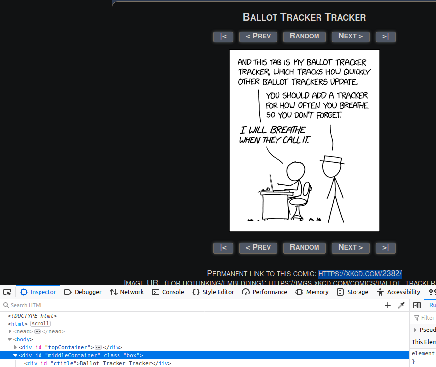
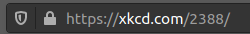
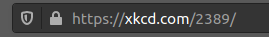
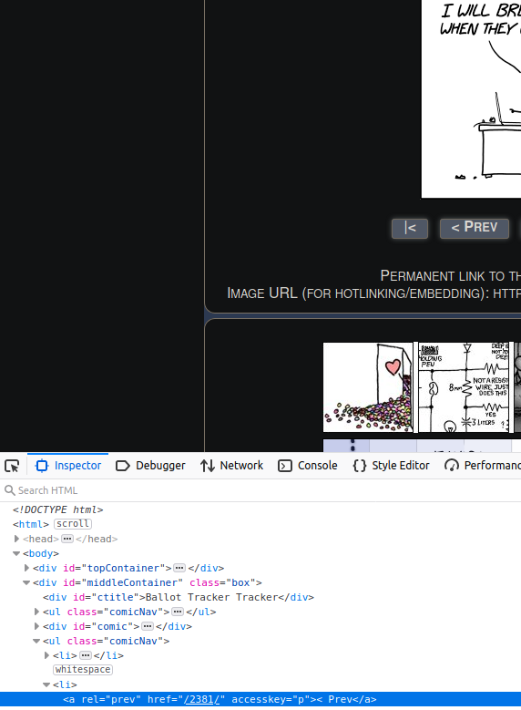
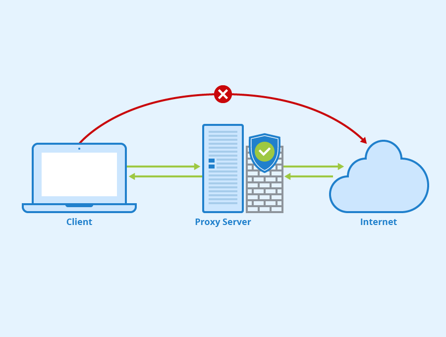

# Scraping the web or gathering data when there are no datasets for the problem you envision solving.

As a data science student, you are given and taught how to use some of the greatest tools and techniques developed by some of the brightest minds of our times to solve real-world problems. While you can find datasets from a variety of topics there will come the point where there isn't enough data available for what you are trying to archive or no such dataset exists, but the information is available online. This is where web scraping can help you bridge the gap since the web is essentially composed of word and picture elements.

Webpage design and layout are not standard across all websites, so you must manually parse through each website to identify how the information you seek is contained. If your goal is to gather data and maintain a data pipeline, for later usage, across from 1 - 20 websites, you can do it manually, but any change done by a webpage you scrape will require code adjustment.


The following libraries are available for you to use in a Python environment:
* [Requests](https://requests.readthedocs.io/en/master/)
    * Extremely popular and capable,and;
    * Its simplicity allows you to use it for API calls and scraping.
* [Beautiful Soup 4](https://www.crummy.com/software/BeautifulSoup/bs4/doc/)
    * Can only parse HTML and requires additional libraries (i.e. Selenium) to parse content created by JS;
    * Has a large community, and;
    * Easy and comprehensive documentation.
* [Scrapy](https://scrapy.org/)
    * Steep learning curve;
    * needs additional libraries (e.g. splah/Selenium) to handle hefty JavaScipt pages;
    * synthax close to Django,and;
    * Highly modular due to its python class usage.

This tutorial will focus on Scrapy due to its asynchronous capabilities, powerful command-line capabilities, data pipelines, classes, and complementing libraries. All this together makes this learning endeavour worthwhile.

## Exploratory data analysis
Using a modern browser, I recommend Mozilla or Chrome; you can use the inspect element by right-clicking on the component you wish to study. This window should greet you in your browser. 


From then on, you can find the class variable names for the information you want to extract from the webpage. The inspect method is incredibly useful as we will later use this technique in the command line to confirm that we have the right elements.

Other vital elements in the inspector are the network page (must reload the page, but enables you to see packages passed by the server) and accessibility page(while meant to expose the page information to assistive technology, it allows us to see the info in a JSON format). The network becomes crucial when listening to the browser request in dynamically generated content. [John Watson Rooney](https://www.youtube.com/watch?v=GqICHBfeAWk) goes over how to do it properly, and I highly recommend that you check out more of his content on scraping.

## Before we write our first line of code

All that is required for a webpage to display its content properly, albeit not prettily, is done through [Hyper Text Markup Language](https://developer.mozilla.org/en-US/docs/Learn/HTML/Introduction_to_HTML/HTML_text_fundamentals) (HTML) structure. HTML does so by "wrapping" the info between tags (i.e. \<p>first paragraph<\/p>). Unlike Extensible Markup Language (XML), HTML tags are defined and structured according to HTML5 layout and are standard across all webpages.


While not within the scope of this paper, [Cascading Style Sheets](https://developer.mozilla.org/en-US/docs/Learn/CSS) (CSS) is used to change the font, colour, spacing, etc., of all elements in a webpage and has very little to do with its functionality. This is where color, design and layout choices impact how a website appears to the user.

If we use a house as an example, the HTML language is used in the same way as beams and joists are used, to define the structure and support the entity. Using the same example, CSS is to a house what wall paint, flooring, hanging posters, etc. is to a house.

After HTML and CSS comes JavaScript (JS) which is used to program a web page's behaviour. JS is an essential language in modern web creation. Still, it also creates additional challenges as a heavily scripted JS website can cause our spider  not to return the HMTL structure needed to scrape the website. Unfortunately, I do not fully grasp how modern websites are dynamically generated, and I will have to learn JS in the future. Of note, PHP/Ruby/Ruby on Rail are also used to generate content on webpages dynamically.

## Robot.txt
Robot exclusion standard or robots.txt is a standard used by all websites and set the robot's rules to follow. Scrapy spiders will always check the robots.txt file of a website before proceeding. 

In the robots.txt bellow ,the website indicates that all robots cannot proceed to the website
```
User-agent: *
Disallow: /
```
In the example bellow, all robots cannot proceed to two domains of the webpage out of the entire website but can proceed to /tmp/rules.txt 
```
User-agent: *
Disallow: /cgi-bin/
Disallow: /tmp/
Allow: /tmp/rules.txt

```
Websites do not ban all robots because google and large hosting platforms use robots to index websites and the products displayed on these pages. This practice is often beneficial for sales when a customer types the name of a product in a search engine, and the engine returns a link to the product on your page. This also part of how search engines rate websites. The best example of this ranking system is how every single cooking website has a never-ending the story before the recipe since it increases their ranking, and, as a result, their adds revenue.


It is possible to disable such rules with scrapy, but doing so will most likely result in the blocking of your IP; but as we will see in this tutorial, it is possible to mask your IP using proxies.

For more information, consult: [/robot.txt](https://www.robotstxt.org/robotstxt.html)
For an entertaining example, read [wikipedia.org/robots.txt](https://en.wikipedia.org/robots.txt)
## Installing Scrapy 
Installing Scrapy is very [easy](https://docs.scrapy.org/en/latest/intro/install.html):
* if you are using a conda environment:
```
conda install -c conda-forge scrapy
```
* if you want a direct python install
```
pip install Scrapy
```
Both methods will work fine.
## Setting our environment for the first time
Using any terminal on your machine, type the following command in the directory of your choice
```
scrapy startproject {NameOfYourProject}
```
Scrapy will automatically create:
* spiders folder where all your spiders's py files are located;
* [items.py](https://docs.scrapy.org/en/latest/topics/items.html): allows you to create item classes to handle various data.;
* [middlewares.py](https://docs.scrapy.org/en/latest/topics/spider-middleware.html?highlight=spider-middleware): file where you can create custom functionalities for processing requests. Refer to the documentation but also do not forget to enable them in the settings file afterward.;
* [pipelines.py](https://docs.scrapy.org/en/latest/topics/item-pipeline.html?highlight=pipeline): python class allowing you to process response elements, must be enabled in the settings file afterward. I recommend checking the advanced spider's section as any pipeline listed in the setting file will force any items classes generated to go through. This becomes an issue when you have multiple spiders extracting different items classes.
* [settings.py](https://docs.scrapy.org/en/latest/topics/settings.html): the most important file for our spider as it profoundly alters its behaviour. Of note, you can list specific spider settings by writing them in the spider class.

All you need to get started writing your first spider is to create a .py script in the spider's folder.

## Exploratory Analysis using the command line
Let's get started using the command line first 
```
scrapy shell https://xkcd.com/2382/
```
The most important thing is to see what response we get from the server. In our case, it's a 200 response but lookout for 404 and 500 errors.
```
# in our case
2020-11-07 20:53:35 [scrapy.core.engine] DEBUG: Crawled (200) <GET https://xkcd.com/2382/> (referer: None)
```
Since programming is an iterative process, the command line allows us to safely explore the server's answer without continually ping the server. From then on, the world is our oyster, and we can safely explore the data. I highly recommend writing your data extraction for loops first in the CLI before running it with your spider.

We will mainly use [CSS selectors](https://www.w3.org/TR/selectors-3/#selectors) which do not return support text nodes or attribute value but can do so using: 
```
::text or ::attr(name)
```

While I prefer CSS selector, you can also use .xpath() to select the xml node. Also, CSS selectors use xpath under the hood. I highly recommend this source when using [CSS](https://www.w3schools.com/cssref/css_selectors.asp) to indicate a class or id is different.

Let's find the XKCD number, title, image URL, and hidden text. 
Using the element inspector in the browser, we find that the title info wrapped in id=title and subordinate to id=middleContaiter.


[I also really recommend this extension](https://selectorgadget.com/) as it makes CSS selection and isolation much easier visually.
```
In [1]: response.css('#middleContainer #ctitle::text')
Out[1]: [<Selector xpath="descendant-or-self::*[@id = 'middleContainer']/descendant-or-self::*/*[@id = 'ctitle']/text()" data='Ballot Tracker Tracker'>]
```
This is not helpful since we want the information and not the entire container. We can use extract() or extract_first(), but they are old methods that have been superseeded with .get() and getall(). Of note you can index getall() like so:
```
response.css('SomeContent')[:2].getall()
```
```
# Title
In [2]: response.css('#middleContainer #ctitle::text').get()
Out[2]: 'Ballot Tracker Tracker'
```
Now that we successfully extracted the first element we can extract the rest. I highly recommend you try yourself extracting the information yourself before looking at the answers for you will remember the process much better.
```
# the image 
In [3]: response.css('#middleContainer #comic img::attr(src)').get()[2:]
Out[3]: 'imgs.xkcd.com/comics/ballot_tracker_tracker.png'

# the hidden text
In [4]: response.css('#middleContainer #comic img').re(r'title="(.*?)"')
Out[4]: ['Good luck to Democrats in the upcoming Georgia runoff elections, and to the Google Sheets SREs in the current run-on elections.']

# comic #
In [5]: response.css('#middleContainer ul li a::attr(href)')[1].re(r'(\d+)')
In [5]:['2381']
```
I highly recommend that you refresh your memory on [regex](https://regexone.com/lesson/line_beginning_end) and test them [beforehand](regex101.com/). Also, a refresher on Python classes is not a bad idea either.

Now that we have successfully extracted all the information in the shell, we are ready to write the script.
## Writing our first spider
Now that we are familiar with the server's response, we are ready to write out the script. We only need two things for that: a class and the parse method to process the spider's response.
```python
import scrapy
import re

class PostsSpider(scrapy.Spider):
    # name required for scrapy when calling the crawl method
    name = 'xkcdScraper'
    start_urls = ['https://xkcd.com']

    def parse(self,response):

        # the 3 lines bellow extract the comic# and allows us to loop through the page (later)
        next_page = response.css('#middleContainer ul li a::attr(href)')[1].get()
        nextPageRegex = r'(\d+)'
        match = re.search(nextPageRegex,next_page)
        # create a generator for the reponse
        yield{
            'comic title' : response.css('#middleContainer #ctitle::text').get(),
            'comic number': int(match[0]),
            #'image link' : response.css('#middleContainer #comic img').re(r'imgs.+.jpg'),
            'image link' :response.css('#middleContainer #comic img::attr(src)').get()[2:],
            'hidden text' : response.css('#middleContainer #comic img').re(r'title="(.*?)"')
            #response.css('#middleContainer #comic img::attr(title)').get()
        }

```
With a terminal open in the location of our spider we passing the following commands
```
# -o will output the results in a json file
scrapy crawl xkcdScraper -o xkcdResults.json
```
In the terminal it should return this:
```
2020-11-08 10:36:59 [scrapy.core.scraper] DEBUG: Scraped from <200 https://xkcd.com>
{'comic title': 'Ballot Tracker Tracker', 'comic number': 2381, 'image link': 'imgs.xkcd.com/comics/ballot_tracker_tracker.png', 'hidden text': ['Good luck to Democrats in the upcoming Georgia runoff elections, and to the Google Sheets SREs in the current run-on elections.']}
```
And opening the xkcdResults.json should display the exact same information.

## Looping
For looping successfully, you are looking to find a valid URL string that leads to a right page. In the XKCD example. it is impperative to look at the changes in the URL of your browser to see the pattern used by the website. I recommend watching this video as the [author skillfully loops](https://www.youtube.com/watch?v=ALizgnSFTwQ) in the shell and in a py file. 

For our spider we notice that whenever we change the page, the URL changes the number contained in the URL. This leads us to believe that if we can find the comic number and append it to the base URL (https://xkcd.com/{commic#}), we can reliably yield the next page.




Since our goal is to crawl an entire website without defining every single page's URL we can loop the spider using the urljoin method and then issue another request. Luckily for us, the comic # is also used as page index, so adding the following code in the class parse method should allow us to loop. You can confirm using the inspector tool in your browser.



I want to remind you that one of the field, we tried to save, comic number, is also the addition to the base URL that allows us to access the next page. Whether you wish to start at comic 1 to the latest or vice versa is up to you.


```python
        next_page = response.css('#middleContainer ul li a::attr(href)')[1].get()
        nextPageRegex = r'(\d+)'
        match = re.search(nextPageRegex,next_page)

        # we are using the comic # as a way to stop
        if int(match[0]) > 2300:
            next_page = response.urljoin(next_page)
            yield scrapy.Request(next_page,callback=self.parse)
```
If you want to scrape the to the end:
```python
        if next_page is not None:
            next_page = response.urljoin(next_page)
            yield scrapy.Request(next_page,callback=self.parse)


```
Scrapy schedules the scrapy.Request object returned by the start_requests method of the spider. In our case, we chose to use start_urls as a shortcut. Upon receiving a response for each one, it instantiates Response objects. It calls the callback method associated with the request (in this case, the parse method), passing the response as an argument. The parse method will generate the information we seek and then create a scrapy.Request which will then be processed by the parse method, which is akin to a while loop.

## Item containers
So far we wrote our spider in a single script but as you realized this is messy. The general idea is Extracted data -> Temporary containers -> databse

In the items.py file you can add the following fields
```python
class XkcdtestspiderItem(scrapy.Item):
    # define the fields for your item here like:
    #name = scrapy.Field()
    comicTitle = scrapy.Field()
    comicNumber = scrapy.Field()
    comicImageLink = scrapy.Field()
    comicHiddenText = scrapy.Field()
```
Back to our spider we need to import the method
```python
from ..items import XkcdtestspiderItem
```
Then we create a class instance and modify the parse method accordingly
```python
    def parse(self,response):

        comic = XkcdtestspiderItem()

        next_page = response.css('#middleContainer ul li a::attr(href)')[1].get()
        nextPageRegex = r'(\d+)'
        match = re.search(nextPageRegex,next_page)

        comic['comicTitle'] =  response.css('#middleContainer #ctitle::text').get()
        comic['comicNumber'] = int(match[0])
        comic['comicImageLink'] = response.css('#middleContainer #comic img::attr(src)').get()[2:]
        comic['comicHiddenText'] = response.css('#middleContainer #comic img').re(r'title="(.*?)"')

        yield comic
```
now instead of generating a dictionary, we can yield the class instance comic
## Files and images items
Have you have noted we didn't download the image. Scrapy allows you to download using the file/image pipeline and required field. In the example bellow, we wanted the image but also more information. [Check the documentation](https://docs.scrapy.org/en/0.24/topics/images.html) as it can be finicky, and you may have to create a test spider before integrating into your main spider.
```python
class FlyerItem(scrapy.Item):
    store = scrapy.Field()
    flyersDate = scrapy.Field() # the week the flyer is valid for
    
    # Required field bellow for files
    file_urls = scrapy.Field()
    files = scrapy.Field()
    # Required field above

    # image_urls = scrapy.Field() # if using images
    # images = scrapy.Field() # if using images

    spider = scrapy.Field()
    page = scrapy.Field()
    timeScraped = scrapy.Field()
```
In our code, we used files even though the file format we will download is an image. I don't know why this worked for me instead of images. You will understand the code below if you read the pipeline section.  
```python
class flyerSpider(scrapy.Spider):
    # class variable for crawl command
    name = 'fSpider'
    
    # If you have multiple spiders that have different pipelines, it is easier to have it part of the main spider.
    custom_settings = {
        'ITEM_PIPELINES' : {
    'scrapy.pipelines.images.FilesPipeline': 1,
    'GroceryItemIndexer.pipelines.FlyerPipeline': 500,
        },
        # FILE_STORE is the download location
        'FILES_STORE' :"/home/henri/Documents/Lighthouse-lab/Databases/final project db/flyerScrapedData",
        # Scrapy filters duplicate requests by default, otherwise it 
        'DUPEFILTER_CLASS' : 'scrapy.dupefilters.BaseDupeFilter'
    }
```

## Item pipelines
We have so far extracted the data onto a .json/.xml/.csv file.

Before storing the data into a database, we need to have it run through the item pipeline.

Typical uses of item pipelines are:

   * cleansing HTML data
   * validating scraped data (checking that the items contain certain fields)
   * checking for duplicates (and dropping them)
   * storing the scraped item in a database
   * creating a new field based on the data we received
First step is to uncomment the pipeline in settings
```python
ITEM_PIPELINES = {
   'xkcdTestSpider.pipelines.XkcdtestspiderPipeline': 300,
}
```
The 300 number refers to the pipeline priority, and so if you have multiple pipelines, you can dictate the order. Ensure that any further pipelines created afterward are added in the setting files. 
When the parse method yields an item, it will, if available, pass it to the pipeline for processing. To confirm that the pipeline receives the desired info, we will write the following code:
```python
from itemadapter import ItemAdapter

# you can have multiple classes
class XkcdtestspiderPipeline:
    def process_item(self, item, spider):
    # confirming the data is correct
        for k,v in item.items():
            print(f'pipeline key: {k}; value: {v}')
        return item
```
Which returned:
```
pipeline key: comicTitle value: Ballot Tracker Tracker
pipeline key: comicNumber value: 2381
pipeline key: comicImageLink value: imgs.xkcd.com/comics/ballot_tracker_tracker.png
pipeline key: comicHiddenText value: ['Good luck to Democrats in the upcoming Georgia runoff elections, and to the Google Sheets SREs in the current run-on elections.']
```
If you have multiple spides in a project it may comes to a point where desired pipelines conflict. Instead of creating a new project you can use the custom pipeline

```python
class flyerSpider(scrapy.Spider):
    # class variable for crawl command
    name = 'fSpider'
    custom_settings = {
        'ITEM_PIPELINES' : {
    'scrapy.pipelines.images.FilesPipeline': 1,
    'GroceryItemIndexer.pipelines.FlyerPipeline': 500,
        },
        'FILES_STORE' :"/home/henri/Documents/Lighthouse-lab/Databases/final project db/flyerScrapedData",
        # Scrapy filters duplicate requests by default, otherwise it 
        'DUPEFILTER_CLASS' : 'scrapy.dupefilters.BaseDupeFilter'
    }
```
## Advanced spiders writing
You do not have to write everything in a single method. You can create multiple parsing functions and go through using the callback parameter.
```python

# e.g.
def start_requests(self):
    # {work}
    scrapy.Request(url=start_url, callback=self.storeParser)

def storeParser(self):
    # {work}
    scrapy.Request(url=nextStore[1], callback=self.departmentParser)

def departmentParser(self):
    # {work}
    scrapy.Request(url={your next url}, callback=self.{nextMethod})
```
If your goal is to scrap for a long duration you may run the risk of getting banned. What you can do it introduce randomness and pause your scraping:
```python
import time
    self.logger.info(f'--------long break 5-8 minutes')
    time.sleep(random.randint(5, 8)*60)

    self.logger.info(f'--------short Break 3-10 seconds')
    time.sleep(random.randint(3, 10))
```
Also using randomness in the order we pick URL is also important
```python
    def randomUrl(self,dictionary):
    """
    Takes a dictionary with{url, nameCat}
    """
        # we want to obtain a random index. Since we are passing a Dict Python wants a list
        randIdx = random.sample(list(dictionary),1) # provides a the random index 
        
        # since we do not want to revisit the address we remove it from the list, which also changes the list size the next time, we will use the function
        
        selectedURL = dictionary.pop(randIdx[0])
        return selectedURL
```

## Storing data in database
You can store the pipeline's data into the following popular databases: sqlite3/MySQL/MongoDB. Due to the unstructured nature of scraping and its ever-changing nature, we will use NoSQL language.

First step is to [install](https://docs.mongodb.com/manual/administration/install-community/) MongoDB and then start it.
```
# starting mongoDB (systemd)
sudo systemctl start mongod
# confirm that mongoDB is active
sudo systemctl status mongod
# run mongo in shell
mongo
```
You want to look for the port MongoDB is using, which is shown after running mongo.
```
MongoDB shell version v4.4.1
# MongoDB is listening to prt 27017 of our local machine.
connecting to: mongodb://127.0.0.1:27017/
```
Confirm where the data will be located or [create](https://askubuntu.com/questions/982673/where-is-mongo-database-folder-on-the-filesystem) a new path
```
grep -i dbPath /etc/mongod.conf
```

Next install pymongo eitheir through pip or conda
```
conda install -c anaconda pymongo
pip install pymongo
```
Ensure that the pipeline is allowed in the setting file and after we need to modify the pipeline file
```python
from itemadapter import ItemAdapter
import pymongo

class XkcdtestspiderPipeline:

    def __init__(self):
        # requires two arguments
        self.conn = pymongo.MongoClient(
            '127.0.0.1',
            27017
            )
        # creating the database
        db = self.conn['randallMunroe']
        # creating a table
        self.collection = db['webComic']

    def process_item(self, item, spider):
        
        self.collection.insert_one(dict(item))

        # testing
        # for k,v in item.items():
        #     print(f'pipeline key: {k}; value: {v}')
        return item
```
Accessing the info in [MongoDB shell](https://stackoverflow.com/questions/24985684/mongodb-show-all-contents-from-all-collections)
```python
# start MongoDB
mongo
# see what DB are available
show dbs
# selecting our db
use randallMunroe
# show all tables in the db
show collections
# see all the data
db.webComic.find().pretty()
```
You should see the following in the in the MongoDB
```
{
	"_id" : ObjectId("5fa871fb6dd9181583093173"),
	"comicTitle" : "Ballot Tracker Tracker",
	"comicNumber" : 2381,
	"comicImageLink" : "imgs.xkcd.com/comics/ballot_tracker_tracker.png",
	"comicHiddenText" : [
		"Good luck to Democrats in the upcoming Georgia runoff elections, and to the Google Sheets SREs in the current run-on elections."
	]
}
```
Usefull commands
```
show dbs() # show available db
use {thedbname} #db selection
show collections # shows all your tables
db.{theCollectionName}.count() # how many entries
db.{theCollectionName}.find().pretty() # show the data pretily
```
Of note: more logic can be implemented when passing data to the database so that we do not pass duplicates of records already present in.
## Parameter setting (robot politeness)
Ultimately, unless your express goal is to create a Denial Of Service (DOS) attack,  you do not want your robot to negatively impact the website's performance it is scraping the data from.

First and foremost, obey websites /robots.txt rules
```python
# enabled by default
ROBOTSTXT_OBEY = True
```
Identifying your robot and yourself
```python
BOT_NAME = 'xkcdTestSpider'
USER_AGENT = 'XKCDfansAndCo-MyXKCDCrawler (ILoveXKCD@gmail.com)'
```
Since Scrapy spiders are incredibly fast and their asynchronous capabilites can create stresses you can tune the following parameters manually:
```python
# Configure maximum concurrent requests performed by Scrapy (default: 16/max 32)
CONCURRENT_REQUESTS = 4 
DOWNLOAD_DELAY = 3 # Default is 0 second
```
Scrapy offers an automatic option through throttling which I do recommend overall instead of doing so manually:
```python
# AutoThrottle automatically adjusts the delays between requests according to the current web server load.
AUTOTHROTTLE_ENABLED = True
```
Programing a spider may require you to ping the same page multiple time as your spider evolves. This process may cause undue stress on the server at best, and, at worst get your IP banned. Enabling the cache saves the response URL content in a temporary file so that you do now have to ping the website when debugging the spider. 
```python
HTTPCACHE_ENABLED = True
```
If a website has an API please use it, for it will most likely relieve some headache.

## Proxies/User agents (unpolite robot)
We are not very polite, but it is still important to be aware of its capabilities.

### User agents
As we learned in robots.txt, you can bypass website restrictions by using a different [user agent](https://developer.mozilla.org/en-US/docs/Web/HTTP/Headers/User-Agent). A user agent is a character string that lets servers and network peers identify the application, operating system, vendor, and version of the requesting user agent. You can do so by modifying the robot user agent in the settings file. You can even trick websites into believing that you are [Google](https://developers.google.com/search/docs/advanced/crawling/overview-google-crawlers?hl=en&visit_id=637420217784273211-1628247958&rd=1).
```python
# Crawl responsibly by identifying yourself (and your website) on the user-agent
#USER_AGENT = 'xkcdTestSpider (+http://www.yourdomain.com)'
```
The other method uses several user agents to trick the website into thinking that the robot is from different computers. Luckily for us, a package like this exists already exists and contains close to 2200 other user agent.
```
pip install scrapy-user-agents
```
Add the following code in the settings file.
```python
DOWNLOADER_MIDDLEWARES = {
    'scrapy.downloadermiddlewares.useragent.UserAgentMiddleware': None,
    'scrapy_user_agents.middlewares.RandomUserAgentMiddleware': 400,
}
```

If curious, you can see yours [here.](https://www.whatismybrowser.com/detect/what-is-my-user-agent)

### Proxies

Services like [this residential/aatabase IPs](https://smartproxy.com/) 

To put it very simply, proxies allow you to use the residential or database IP to make the query while isolating your own Ip. This is important since a webpage server can ban the Ip (HTTP Error 503)


For our spider, we will be using a different IP address to not get our own IP address banned. Essentially every request you make will use a different IP. Similarly to user agents we can install the following [package](https://github.com/rejoiceinhope/scrapy-proxy-pool):
```
pip install scrapy_proxy_pool
```
Add the following lines in the settings file:
```python
PROXY_POOL_ENABLED = True
DOWNLOADER_MIDDLEWARES = {
    'scrapy_proxy_pool.middlewares.ProxyPoolMiddleware': 610,
    'scrapy_proxy_pool.middlewares.BanDetectionMiddleware': 620,
}
```
Please be aware that using this free proxy method takes significantly longer than using a user agent since some IP addresses may not be working. You can also create an IP list from various [addresses](https://free-proxy-list.net/). But you will have to check if they are available first before using them. [John Watson Rooney](https://www.youtube.com/watch?v=vJwcW2gCCE4) shows a very clever way to check for valid IP.

Here is a quick spider that allows you to check you IP. Of none the IpTimestamp() class in the code is the item instance that I configured in items.py.

```python
import scrapy
from datetime import datetime
#from ..items import IpTimestamp,

def timestampReceival():
    now = datetime.now()
    return  now.strftime("%m/%d/%Y, %H")

class AmazonWholeFood(scrapy.Spider):
    # variable name required to run scrtapy crawl
    name = 'testip'
    
    def start_requests(self):
        urls = ['https://httpbin.org/ip']
        for url in urls:
            request = scrapy.Request(url=url, callback=self.parse)
            yield request

    def parse(self,response):
        ipInfo = IpTimestamp()
        ipInfo['ip'] = response.css('p::text').getall()
        ipInfo['time'] = timestampReceival()
        yield ipInfo
# the item.py
class IpTimestamp(scrapy.Item):
    ip = scrapy.Field()
    time = scrapy.Field() # doesn't work

```

Now, this becomes time-consuming since you need to check for IP before scraping. In this case, you may want to use proxies to hide your IP and have it rotate every few requests to every few minutes.


The proxy service that I used for my project had [support for scrapy](https://help.smartproxy.com/docs/how-to-setup-proxy-on-scrapy-proxy-middleware) if you are using a different proxy or VPN check how authentification to the proxy is acquired. 

It is very important to never save your key or identification so use this tutorial for [your environment](https://towardsdatascience.com/how-to-hide-your-api-keys-in-python-fb2e1a61b0a0)
```python
DOWNLOADER_MIDDLEWARES = {
    # userAgent change
    'scrapy.downloadermiddlewares.useragent.UserAgentMiddleware': None,
    'scrapy_user_agents.middlewares.RandomUserAgentMiddleware': 400,
    # proxy
    'scrapy.downloadermiddlewares.httpproxy.HttpProxyMiddleware': 110,
    'GroceryItemIndexer.smartproxy_auth.ProxyMiddleware': 100,
    # 
    #'scrapy.downloadermiddlewares.retry.RetryMiddleware': 90,
}


SMARTPROXY_USER = os.environ.get("SMARTPROXY_USER") ## Smartproxy Username (Sub-user)
SMARTPROXY_PASSWORD = os.environ.get("SMARTPROXY_PASSWORD") ## Password for your user
SMARTPROXY_ENDPOINT = os.environ.get("SMARTPROXY_ENDPOINT") ## Endpoint you'd like to use #gate.smartproxy.com
SMARTPROXY_PORT = os.environ.get("SMARTPROXY_PORT") ## Port of the endpoint you are using.
```

To conclude, if you intend to hide your IP, it is better to use proxies. I have read that scrapy can be used in combination with TOR, but this is something that I haven't explored.

## Full spiders examples

Please have a look at my [git hub final project folder.](https://github.com/Vanderscycle/lighthouse-data-notes/tree/master/FinalProject/GroceryItemIndexer/GroceryItemIndexer)

## Challenges of scraping

The creation of robots to create your own data is a fascinating endaveour and a manually intensive process. Using Convoluted [Neural Networks (CNN)](https://www.youtube.com/watch?v=q0lQAMqQViA) to get the data and extract the data using Neuro-linguistic programming (NLP) would greatly increase the range of our spiders.

The example we used, XKCD, is very friendly to beginners as it is mostly an HTML page, but modern websites using a JS framework can cause our robot not to recognize the data. Scrapy can be integrated by using [Splash](https://github.com/scrapy-plugins/scrapy-splash) and [Selenium](https://www.selenium.dev/), but it adds greater levels of complexity to our robot. I am unable, at the moment, to venture past as I require JS knowledge.

What more if that manually encoding a scrapper for a specific webpage takes a lot of time to get running.
## Special thank yous

I want to thank [buildwithpython](https://www.youtube.com/channel/UCirPbvoHzD78Lnyll6YYUpg) youtube channel, [Traversy Media](https://www.youtube.com/user/TechGuyWeb) youtube channel, [John Watson Rooney](https://www.youtube.com/channel/UC8tgRQ7DOzAbn9L7zDL8mLg) youtube channel, [Scrapinghub](https://blog.scrapinghub.com/) blog and anyone who took some of their precious time to answer questions on StackOverflow. Without you, I could not have grasped the concept of scrapy in the time required to write this paper.

## Closing statement

I am a student and future professional who is keen on learning, if you have any questions or would like to point out any inaccuracies, please email me.

Thank you for reading.

[Henri Vandersleyen](hvandersleyen@gmail.com)

Data science student at Lighthouse lab

