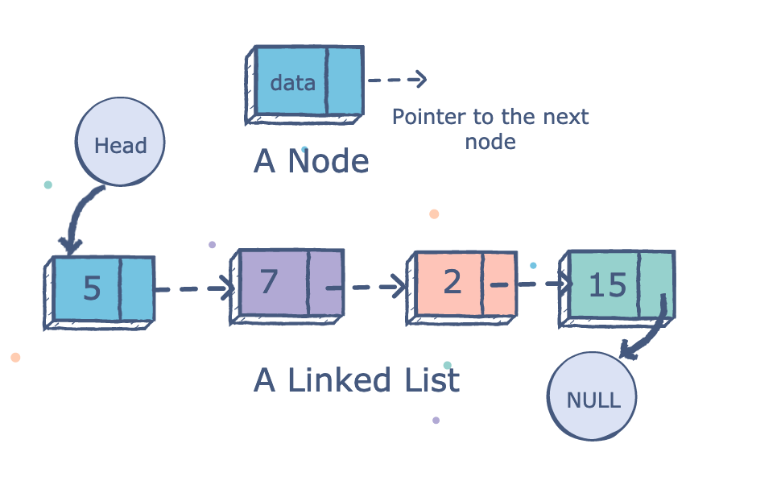
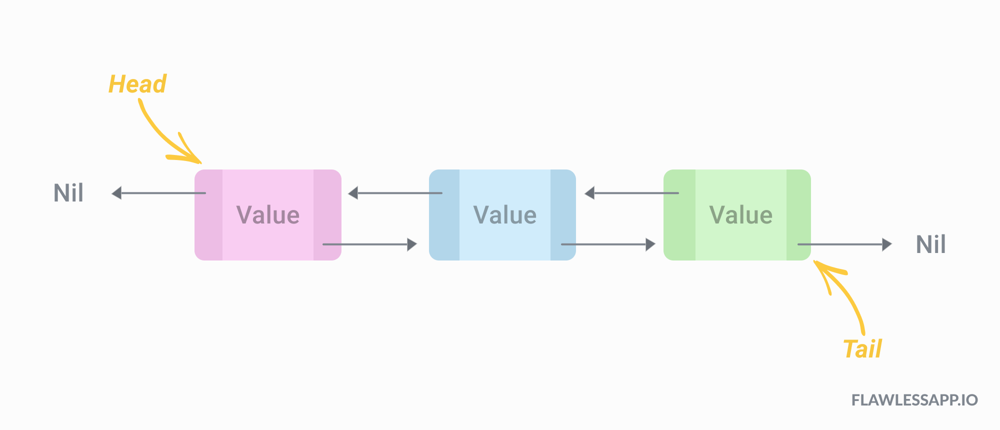
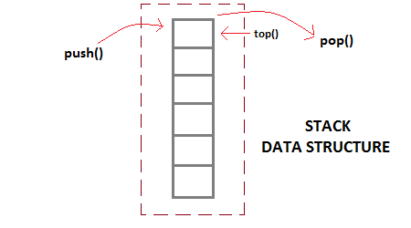
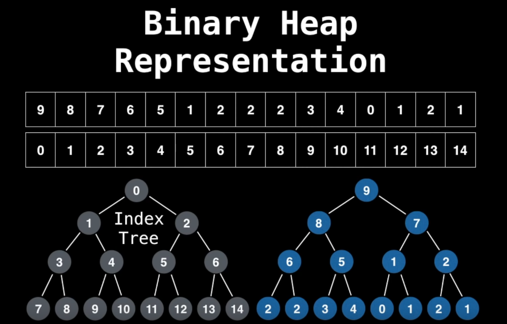

# Data Structure without the undergraduate degree
Notes taken from freeCodeCamp.org video in my quest to learn more about databases and find employment.

 Why care? For me I came into contact with data structures when working on a Database Management System (DBMS) university course where I learned that indexes could take different exotic forms such as: b tree, IASM hash index,etc.. This came as a shock since I had no idea about any of them, but I knew that they are not only important to a program's performance but also because they are the building blocks of modern programming.

## Data structure definition
From [wikipedia](https://en.wikipedia.org/wiki/Data_structure) it is defined as follow: a data structure is a data organization, management, and storage format that enables efficient access and modification.

Data structures are generally based on the ability of a computer to fetch and store data at any place in its memory, specified by a pointer—a bit string, representing a memory address, that can be itself stored in memory and manipulated by the program.

The implementation of a data structure usually requires writing a set of procedures that create and manipulate instances of that structure. The efficiency of a data structure cannot be analyzed separately from those operations.

Summary: Data Structures (DS) is a way of organizing the data so that it can be used effectively. they are essential ingredients in creating fast and powerful algorithms.Good programmers knows when to use each type of data structure.
## Abstract Data Type (ADT)
From [StackOverflow](https://stackoverflow.com/questions/10267084/what-is-adt-abstract-data-type): Abstract Data Type(ADT) is a data type, where only behavior is defined but not implementation. Opposite of ADT is Concrete Data Type (CDT), where it contains an implementation of ADT.

Real world example, we want to go from point A -> B using a method of transportation (abstract data type) how we implement the solution that is our implementation

## Big O notation (computational complexity)
Big O notation is a mathematical notation that describes the limiting behavior of a function when the argument tends towards a particular value or infinity. 

In computer science, big O notation is used to classify algorithms according to how their run time or space requirements grow as the input size grows.

Summary: gives an upper bound of the complexity in the worst case, helping to quantify performance as it becomes arbitrarily large.

Big O propreties:
* O(n+c) = O(n)
* O(cn) = o(n), c > 0
* f(n) = 7log(n) + 2n^3 ->O(f(n)) = O(n^3) Bad!

n being the amount of data and b > 1
* constant time: O(1) (size of data doesn't matter)
    * ```for i in range(12)```
* logarithmic time: O(log(n))
    * binary search algo
* linear time: O(n)
    * ```for i in n```
* quadric time: O(n^2)
    * ```[word for sentence in text for word in sentence]```
* exponential time: O(b^n)
    * finding all subsets of a set
* Factorial time: O(n!)
    * finding all permutations of a string


## Python's native data structure
Python comes with its own basic data structures and these are:
* List
* Dict
* Set
* Tupple

While the native Python's data structure is very limited, we can leverage Python modularity by importing the following well known data structures:
* Collection.Deque
* Numpy.array


### Complexity
[reference](https://wiki.python.org/moin/TimeComplexity)

## Dynamic and static arrays

The most used data structure because it is a building block of other data structures.A static array is a fixed length container containing n elements indexable from the range [0,n-1]. A dynamic array can grow and shrink dynamically. The elements of the array are stored [continuously in memory](https://www.cs.swarthmore.edu/~newhall/unixhelp/C_arrays.html). If the array is 2-dimensional then, the first row is stored (in a continuous manner), then the second row, and so on.

indexable: Each slot/index in the array can be referenced with a number.

### Complexity
| Operation | Static Array | Dynamic Array  |
|-|-|-|
| Access | 0(1) | O(1)|
| Search | O(n) | O(n) |
| Insertion | N/A | O(n) |
| Appending | N/A | O(1) |
| Deletion | N/A | O(n) |

Notes:
* Search is linear because we sequentially navigate the array
* Inserting and deletion are linear because all n-elements have to be shifted.
* Appending is constant because the static array is resized
* you can create .md tables [here](https://www.tablesgenerator.com/markdown_tables)

### implementation
One way to implement a dynamic array structure:
1. create a static array with an initial capacity
2. add elements to the underlying static array
3. if adding another element will exceed the capacity, then create a new static arrau with twice (or more) capacity and copy the original elements to it.

### Python implementation
* [class file](https://github.com/Vanderscycle/tutorials-papers/blob/master/dataStructures/demonstrations/dynamicArray.py)
* [test bench file using unittest](https://github.com/Vanderscycle/tutorials-papers/blob/master/dataStructures/demonstrations/test_dynamicArray.py)
* the dynamic array is unordered where during insertions and deletion the array swap values between the desired operation and the last value in the array
## Single & doubly linked list
 A linked list is a sequential list of nodes that hold data which point to other nodes also containing data. Because the way python manage its memory a doubly linked list implementation in Python doesn't take twice as much memory as a singlty linked list

where are linked list used?
* cicular lists
* used in separate chaining, which is present in certian hashtable implementation for hashin collisions
* Used in the implementation of adjacency lits for graphs

### Terminology
* Head: the first node in a linked list
* tail: the last node in a linked list
* pointer: reference to another node
* node: an object containing data and pointers

|  |Pros  | cons |
|-|-|-|
| single  | simple/less memory | cannot access previous elements |
| double | can be traversed backwars | 2x memory  |

### implementation
Singly linked list only hold reference to the next node. We always maintain a refence to the dead of the linked list and a reference to the tail node for quick additions and removal.

Doubly linked list only hold reference to the previous and next node. We always maintain a refence to the dead of the linked list and a reference to the tail node for quick additions and removal from both end of the list/


### Complexity
| Operation | Singly linked | Doubly Linked  |
|-|-|-|
| Search | O(n) | O(n) |
| Insertion (head)| O(1) | O(1) |
| Insertion (tail)| O(1) | O(1) |
| Insertion (middle) | O(n) | O(n) |
| Deletion (head) | O(1) | O(1) |
| Deletion (tail) | O(n) | O(1) |
| Deletion (middle) | O(n) | O(n) |

## Stack
Is a one-ended linear data structure which models a real workl stack by having two operation (push and pop) and one pointer (top) pointing at the block whose is on top of the pile.

They are used in Python's memory, used in undo mechanisms, elements between brackets or sandwiched data with a start and finish,used in recursion...
### implementation

Best to th
### Complexity
| Operation | stack |
|-|-|
| Pushing | O(1) | 
| Popping | O(1) | 
| Peeking | O(1) |
| Searching | O(n) |
| Size | O(1) |

## Queue

A queu is a linear data structure which models real worl queues (like the one at the bank) by having two primary operations (enque and dequeue)


Can be used for breadth first search (BFS) graph traversal.


Where we would load all the unvisited neighbours in a queue and then dequeuing them until we either find the value of the search or we reach the end of the graph.
### terminology

No consistent terminology for inserting and removing elements:
Enqueue = Addiding = Offering
Dequeue = substraction = 
Removal (emptying the entire queue)
Instead of using front back we will use head/tail
### implementation
First-in last-out (FILO) model 
### Complexity
| Operation | queue |
|-|-|
| Enqueue | O(1) | 
| Dequeue| O(1) | 
| Peeking | O(1) |
| Contains | O(n) |
| Removal | O(n) |
| Is Empty | O(1) |
## Priority Queues and heaps
A Priority queue is an Abstract Data Tyoe (ADT) that operates similar to a normal queue except that each element has a certain priority. The priority of the elements in which elements are removed from the PQ. Because it is an ADT it can be implemented in various ways and one of them being through a heap.

A bit caveat is that the PQ only supports comparable data (data must be able to be ordered in some way least to greatest or vice-versa).

A heap is a tree based DS that satisfies the heap invariant(heap property): If A is a parent node of B then A is ordered with respect ot B for all nodes A,B in the heap. If using min heap, all nodes bellow each parent node are equal or greater than its parent node. Also heaps cannot contain cycles (where a path between two branches allow for infinite rotation)


Used in:
* [Dijkstra's shortest path algortihm](https://en.wikipedia.org/wiki/Dijkstra%27s_algorithm)
* [Best First Search](https://en.wikipedia.org/wiki/Best-first_search) (greedy Algo)
* [Minimum spannin tree](https://en.wikipedia.org/wiki/Minimum_spanning_tree)
* [Huffman lossless compression](https://en.wikipedia.org/wiki/Huffman_coding)
### Implementation
Using a heap tree we can implement a PQ. Other methods are unsorted list, but the time clomplexity is greater tranversing every elements of the list(O(n)). There are multiple [kinds of heaps](https://en.wikipedia.org/wiki/Heap_(data_structure)).

Binary heap is a binary tree that supports the heap invariant and has no more than two children per node. A complete binary tree is a tree which at every level, except the last is filled and all nodes are as far left as possible. Of note, you can use an array to represent a tree.

Using the following zero indexed method:
Let i be the parent node index
* left child index = 2i +1
* right child index = 2i +1

Adding element to a binary heap: We create a new leaf (the leftmost available position) with the number reagardless of its position and then bubble it up (comparing its value as it bubble to its position)

Removing an element to a binary heap: 2 ways Poll(remove the root node) and Remove( any value).
* Poll: swap the root node with the latest value in the array then remove the latest value in the array. Afterwards, we bubble down the root node to its location by swapping to the smallest node. if both children nodes are of equal value we bubble down to the left.
* remove: first we search the value (using the Breath First Search BFS for example), once found we swap with the latest value in the array then remove the latest value in the array. Afterwards, we bubble up or down the value depeding if we satisfy the heap invariant with its neigbhoor nodes.

We Polling is O(log(n)) and removing is O(n) which is inneficient, but can be improved if using hash tables.

This requires us to keep a separate table of the index position of each node value. Since each node value can be repeated, we will store the indices in an array 

## (hash table) to be added later


### Complexity

| Operation | binanry heap |
|-|-|
| Binary Heap construction | O(n) | 
| Polling | O(log(n)) | 
| Peeking | O(1) |
| Adding | O(log(n)) |
| Naive removing | O(n) | 
| Removing using a hash table | O(log(n)) | 
| Naive contains | O(n) | 
| Contains with hash table | O(1) |
Naive because we scan through all the elements. Hash tables requires linear space and also adds overhead to the binary heap implementation. 

### Turning Min PQ into Max PQ
For numerical values: Keep the structure the same but invert the comparable value (e.g.13 -> -13), then repopulate the tree. 

For string values: using [PLY](https://pypi.org/project/ply/) (the python addaptation of lex parsing tool). Lex is a comparator for strings which sorts string in [lexicographic order](https://en.wikipedia.org/wiki/Lexicographic_order) with nlex being its negation.
* lex(s1,s2) = -1 if s1 < s2 lexicographically
* lex(s1,s2) = 1 if s1 > s2 lexicographically
* lex(s1,s2) = 0 if s1 = s2 lexicographically
* nlex(s1,s2) = -(-1) = 1 if s1 < s2 lexicographically
* nlex(s1,s2) = -(1) = -1 if s1 > s2 lexicographically
* nlex(s1,s2) = -(0) = 0 if s1 = s2 lexicographically

[lexicographic order in action](https://www.youtube.com/watch?v=LtlZtFXe8Io)
## Binary Trees

### implementation
### Complexity
## Example
## Example

## section
### implementation
### Complexity
## Example

## Additional resources and reading

Because we do not want our code to be production-like we use [logging](https://www.youtube.com/watch?v=-ARI4Cz-awo) and [unittest](https://www.youtube.com/watch?v=6tNS--WetLI)
## Additional resources and reading
* [free code camp academy](https://www.youtube.com/watch?v=RBSGKlAvoiM)
## Closing statement