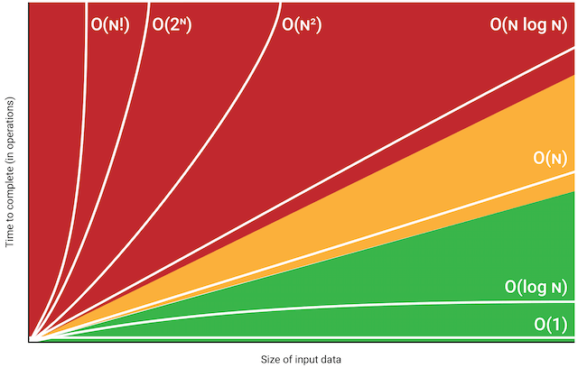
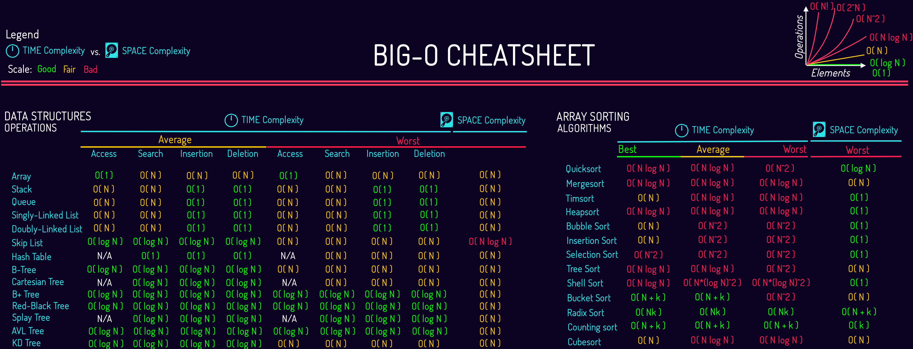

# Data Structure without the undergraduate degree
Notes taken from freeCodeCamp.org video in my quest to learn more about databases and find employment.

 Why care? For me I came into contact with data structures when working on a Database Management System (DBMS) university course where I learned that indexes could take different exotic forms such as: b tree, IASM hash index,etc.. This came as a shock since I had no idea about any of them, but I knew that they are not only important to a program's performance but also because they are the building blocks of modern programming.

## Data structure definition
From [wikipedia](https://en.wikipedia.org/wiki/Data_structure) it is defined as follow: a data structure is a data organization, management, and storage format that enables efficient access and modification.

Data structures are generally based on the ability of a computer to fetch and store data at any place in its memory, specified by a pointer—a bit string, representing a memory address, that can be itself stored in memory and manipulated by the program.

The implementation of a data structure usually requires writing a set of procedures that create and manipulate instances of that structure. The efficiency of a data structure cannot be analyzed separately from those operations.

Summary: Data Structures (DS) is a way of organizing the data so that it can be used effectively. they are essential ingredients in creating fast and powerful algorithms.Good programmers knows when to use each type of data structure.
## Abstract Data Type (ADT)
From [StackOverflow](https://stackoverflow.com/questions/10267084/what-is-adt-abstract-data-type): Abstract Data Type(ADT) is a data type, where only behavior is defined but not implementation. Opposite of ADT is Concrete Data Type (CDT), where it contains an implementation of ADT.

Real world example, we want to go from point A -> B using a method of transportation (abstract data type) how we implement the solution that is our implementation

## Big O notation (computational complexity)
Big O notation is a mathematical notation that describes the limiting behavior of a function when the argument tends towards a particular value or infinity. 

In computer science, big O notation is used to classify algorithms according to how their run time or space requirements grow as the input size grows.

Summary: gives an upper bound of the complexity in the worst case, helping to quantify performance as it becomes arbitrarily large.

Big O propreties:
* O(n+c) = O(n)
* O(cn) = o(n), c > 0
* f(n) = 7log(n) + 2n^3 ->O(f(n)) = O(n^3) Bad!

n being the amount of data and b > 1
* constant time: O(1) (size of data doesn't matter)
    * ```for i in range(12)```
* logarithmic time: O(log(n))
    * binary search algo
* linear time: O(n)
    * ```for i in n```
* quadric time: O(n^2)
    * ```[word for sentence in text for word in sentence]```
* exponential time: O(b^n)
    * finding all subsets of a set
* Factorial time: O(n!)
    * finding all permutations of a string



## Dynamic and static arrays

The most used data structure because it is a building block of other data structures.A static array is a fixed length container containing n elements indexable from the range [0,n-1]. A dynamic array can grow and shrink dynamically. The elements of the array are stored [continuously in memory](https://www.cs.swarthmore.edu/~newhall/unixhelp/C_arrays.html). If the array is 2-dimensional then, the first row is stored (in a continuous manner), then the second row, and so on.

indexable: Each slot/index in the array can be referenced with a number.

### Complexity
| Operation | Static Array | Dynamic Array  |
|-|-|-|
| Access | 0(1) | O(1)|
| Search | O(n) | O(n) |
| Insertion | N/A | O(n) |
| Appending | N/A | O(1) |
| Deletion | N/A | O(n) |

Notes:
* Search is linear because we sequentially navigate the array
* Inserting and deletion are linear because all n-elements have to be shifted.
* Appending is constant because the static array is resized

### Implementation
One way to implement a dynamic array structure:
1. create a static array with an initial capacity
2. add elements to the underlying static array
3. if adding another element will exceed the capacity, then create a new static arrau with twice (or more) capacity and copy the original elements to it.
## Example

## Additional resources and reading

Because we do not want our code to be production-like we use [logging](https://www.youtube.com/watch?v=-ARI4Cz-awo) and [unittest](https://www.youtube.com/watch?v=6tNS--WetLI)
## Closing statement