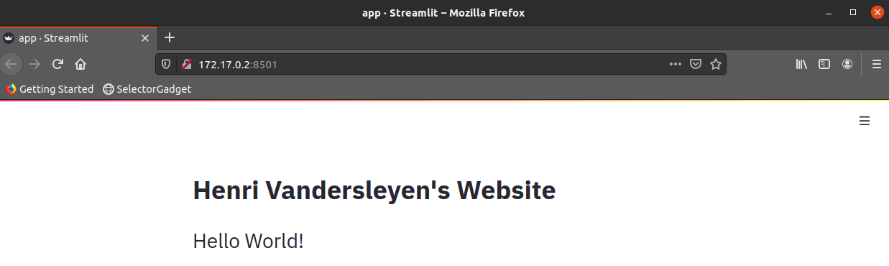
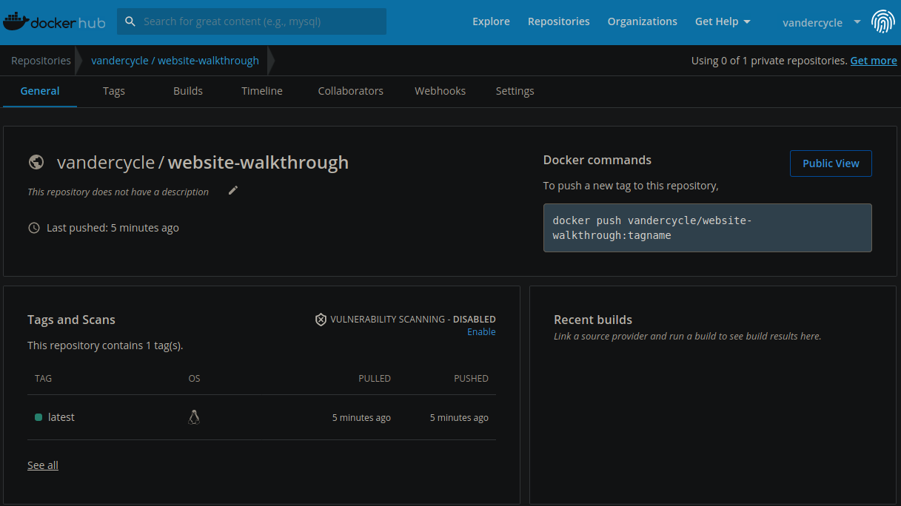
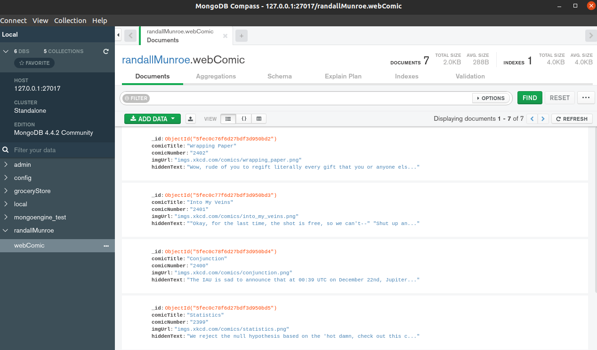
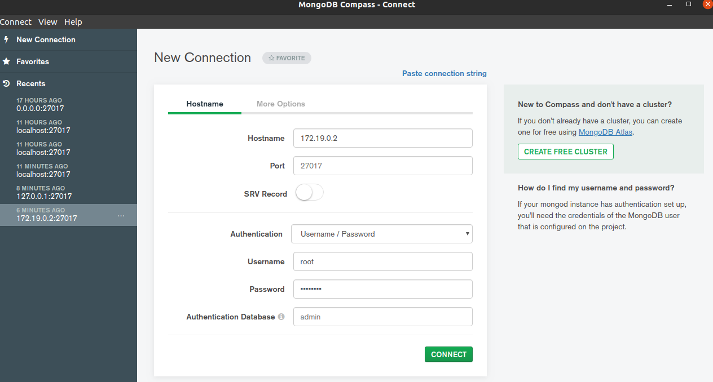

# Mastering Docker after the initial trauma
To add:
* volume for data persistance 
* docker compose
* multiple containers

After a very brief overview and usage during my data science Bootcamp at Lighthouse labs, I was left very confused and unable to fully grasp how powerful a dockerized application can be. To learn about Docker, we will build our own website using streamlit, and dockerize it. This way I hope you will showcase your data science skills and past projects to future employers without having to worry about silly things like hardware or OS.

I can't cover all the theory, nor can I explain it better than the references listed in the *Additional resources and reading* section. Please take this tutorial as a walkthrough where I highly encourage you to go off the beaten path, try, fail and learn, for it is how I learned.

This tutorial is done using a Linux distribution(Ubuntu) and Python.
## What is Docker
Docker is a tool created for to package a single process into a self-enclosed containers, which is run independently of the host hardware and OS configuration. If the container can run on your local machine, it will run on any machine hosting the container.  

## Docker containers vs Virtual Machine 
One of the leading alternatives to a Docker container is the usage of a Virtual Machine. They are very common as you can, for example, run a previous version of windows or other distros inside windows. A virtual machine is isolated from the hardware (often server hardware) it is running, on meaning that any problems with the virtual machine will not impact the host. Each virtual machine is assigned its own virtual hardware (mapped on the server's hardware) that is not shared accross multiple virtual machine instances. 

A virtual machine is essentially a virtual computer-executed on server hardware and controlled through the server's hypervisor. Each virtual machine has their own isolated OS/distros, binaries and libraries required to run the application.

A virtual machine's life-cycle is also intended to be longer than that of a container, and building, running, and stopping a virtual machine takes significantly longer than a docker container. 


A docker container is not a virtual machine, but as described in Docker up & running, is a lightweight wrapper around a single process (your app). Unlike virtual machines, containers are not isolated from their hosts as they share their host OS kernel. As the host, you can peek inside each running container and inspect its content.
```
docker exec -it {nameOfContainer} bash
```
Docker replaced the hypervisor with a daemon that runs in the background and is required for any docker command and operations to work. Unlike the hypervisor, the docker engine can decide the allocation of the host's ressources to individual containers leading to better service. Because virtual machines are virtual abstractions of server hardware, their resources are set and not easily reallocated. The lack of sharing, can lead to an unbalanced load across all virtual machines meaning that one virtual machine is overloaded while other instances are underutilized.

Essentially virtual machine isolates the entire OS/distros while docker isolates only the application leading to greater efficiency in server ressources utilization.

## installing Docker
Docker docs offer a very straightforward [installation](https://docs.docker.com/engine/install/ubuntu/). I highly recommend you follow the installation step-by-step.

To confirm proper installation type in the terminal
```
docker ps
```
of which you should see the following heading
```
CONTAINER ID IMAGE COMMAND CREATED STATUS PORTS NAMES
```

## Docker images
A Docker container image is a lightweight, standalone, executable package of software that includes everything needed to run an application: code, runtime, system tools, system libraries and settings. Container images become containers at runtime, and in the case of Docker containers - images become containers when they run on Docker Engine.

The image is layered because its construction follows a chronological order detailed in a Dockerfile. You do not need a Dockerfile to build an image, as it is done through the command-line interface.

One of the advantages of a docker image is that each image is a snapshot of your program. So if a container from a newer image doesn't run proprely, you can remove the container and recreate it from a previous image.

## Docker containers
A container is a standard unit of software that packages up code and all its dependencies, so it runs quickly and reliably from one computing environment to another. Each container is from a docker image.


## Hosting images
Much like Github, you can push and pull images using [Docker hub](https://hub.docker.com/). One of the great things about Docker hub is that you can have one private container image hosted for free while the rest is publicly hosted.

### Pulling our first image
As the sacred words of hello-world must be enunciated when learning a new language or system, we will pull the hello world container from Docker hub. You can find it [here](https://hub.docker.com/_/hello-world)
```
docker pull hello-world
```
We now need to confirm that the image is available and we can use the following commands for that:
```
docker images
#or
docker image ls
```
We should see something like this in the CLI:
```
REPOSITORY                   TAG                 IMAGE ID            CREATED             SIZE
hello-world                  latest              bf756fb1ae65        11 months ago       13.3kB
```
To run a container from the image, we execute the following command
```
#--name allows us to give a meaningful name to our container otherwise, a random one will be assigned
docker run --name test hello-world
```
The run command should give you a greeting message from the container. You can however, access the logs of a container, whether it is running or stopped, using:
```
# where container id/names are the respective name of the container you want to inspect
docker logs {CONTAINER ID/NAMES}
```

## Installing Streamlit
[Streamlit](https://www.streamlit.io/) allows data scientists who are not yet savvy in front-end development to create beautiful and interactive apps in a short time. 
```
pip install streamlit
```
For a quick introduction to its capabilities:
```
streamlit hello
```
I highly recommend reading the [documentation](https://docs.streamlit.io/en/stable/) while creating your app, as it is well written. 

Before moving on, it is important to remember that Streamlit is still in development, and you can contribute to the [project.](https://github.com/streamlit/streamlit) 

## Creating our website
Navigating to any section of the drive, we create the folder, which will contain all the source code.
```
mkdir streamlitWebsite
```
We will organize the website in the following fashion as we want to separate files based on their purpose. This is especially important in the future when we want a separate folder for our data, image, etc.
```
# current structure of our folder
.
└── src
    └── app.py 
```
You use the [tree](https://www.cyberciti.biz/faq/linux-show-directory-structure-command-line/) to obtain the same visualization as above. Inside the app file, we will create a very simple hello world message.
```python
import streamlit as st

def helloworld():
    st.title("Henri Vandersleyen's Website")
    st.header("Hello World!")

helloworld()
```
Before packaging this simple app into a container, we must confirm that it is working. 
```
# streamlit run {fileLocation}
streamlit run ./src/app.py 
```
You should be greeted with the following message:
```
  You can now view your Streamlit app in your browser.

  Local URL: http://localhost:8501
  Network URL: http://192.168.1.95:8501
```
After confirming that everything is in order, we can package the app into a container. Of note, please change and play with your streamlit app file using the [documentation](https://docs.streamlit.io/en/stable/api.html). Just ensure that prior containerizing the app, it is working locally.

## Requirements.txt
The requirements.txt file is a simple text file used by Dockerfile to specify what python packages are required to run the project. You can do so manually by writing each individual module used in your project, or you can use a Pip requirements.txt generator based on imports in the project. In our case,  we will be using [pipreqs](https://pypi.org/project/pipreqs/). 
```
# synthax pipreqs {folderLocation}
pipreqs ./streamlitWebsite/
```
Which should output:
```
INFO: Successfully saved requirements file in ./streamlitWebsite/requirements.txt
```
Inside the file we should see the following:
```
# of note you can remove the version and type streamlit
streamlit==0.72.0
```
Also, ensure that you update the requirements file after adding or removing modules in your py file. Otherwise, the app inside the container will not run as it will be missing dependencies.
```
# --force allows you to overwrite the requirement file
pipreqs --force ./streamlitWebsite/
```

if you are having issues please confirm the folder location and the presence of a py file. It is very important to be aware of what version of Python you are using as we will be using the same version for our Dockerfile base image. 
```
python -V
```
In my case, I am currently using Python 3.8.5
## Dockerfile 


A Dockerfile is a text document that contains all the commands a user could call on the command line to assemble an image. To create a Dockerfile we type the following in the app folder.
```
# there are no extensions after Dockerfile
touch Dockerfile
```
Our file structure should look like this: 
```
.
├── Dockerfile
├── requirements.txt
└── src
    └── app.py

1 directory, 3 files
```
Looking at the base image of [python](https://hub.docker.com/_/python) in docker hub, we are interested in two sections the simple tags (the version of the base image) and how to use this image, which gives us a template to construct our app. You should also see different versions using duster, alpine, slim, etc. Please check this [reference](https://medium.com/swlh/alpine-slim-stretch-buster-jessie-bullseye-bookworm-what-are-the-differences-in-docker-62171ed4531d) to learn more about them. 

Looking at the template, we will copy the following inside the Dockerfile with slight modification.
```Docker
# base image
FROM python:3
# metadata info
LABEL maintainer="Henri Vandersleyen" email="hvandersleyen@gmail.com"
# exposing container port to be the same as streamlit default port
EXPOSE 8051
# set work directly so that paths can be relative
WORKDIR /usr/src/app
# copy to make usage of caching
COPY requirements.txt ./
#install dependencies
RUN pip install -r requirements.txt
# copy code itself from local file to image
COPY . .
CMD streamlit run ./src/app.py
```
## Our first image
Now that we have the Dockerfile, requirements.txt and the app working locally, we are ready to containerize our folder. <span style="color:red">The dot</span> after streamlit references all files in the folder you are currently on.
```
# while in the streamlitWebsite Folder
# docker build [OPTIONS] PATH | URL | -
docker build -t streamlit . 
```
the -t represent the 'name:tag(optional)' format given to your image. To make version control easier to discern you can use tags in the following format:
```
docker build -t streamlit:beta-pre-prod . 
docker build -t streamlit:latest .
```
<span style="color:red">Before moving forward</span>, if you run any of the build commands above you were most likely greeted by a confusing error message from Docker. Debugging a Dockerfile can be difficult since the error message can overflow the CLI terminal, so this is why we can have the terminal output saved into a log file.
```
docker build -t streamlit:beta-pre-prod .>./log.txt
```
Analyzing the log file, we find the following error at line ~145:
```
  ERROR: Command errored out with exit status 1:
   command: /usr/local/bin/python /usr/local/lib/python3.9/site-packages/pip install --ignore-installed --no-user --prefix /tmp/pip-build-env-wggwsz_m/overlay --no-warn-script-location --no-binary :none: --only-binary :none: -i https://pypi.org/simple -- 'cython >= 0.29' 'numpy==1.14.5; python_version<'"'"'3.7'"'"'' 'numpy==1.16.0; python_version>='"'"'3.7'"'"'' setuptools setuptools_scm wheel
       cwd: None
  Complete output (3410 lines):
  Ignoring numpy: markers 'python_version < "3.7"' don't match your environment
```
So the failed build is due to the base image not being compatible with the version listed in the requirements.txt file. In our Dockerfile we listed the base image as python:3, which means that Docker will pull the latest version of Python for our image, which is 3.9 at the time of writing. There are two ways to solve the problem:
* 1. If the specific version doesn't matter, you can change from streamlit==0.72.0 to streamlit. The command will download the latest version of streamlit for the image.
* 2. Use the appropriate base image version for our app.

We will use option 2. Since the current version of Python we are using is 3.8.5 we will use 3.8-slim. <span style="color:red">Please, confirm what version of the base image you need or modify requirements.txt by removing the version of each modules</span> (e.g. streamlit==0.72.0)
```Docker
# base image
FROM python:3.8-slim
# metadata info
{...}
```
Running the build command again:
```
docker build -t streamlit:beta-pre-prod .
```
If the build is successfull, we should see the following images: 
```
#docker images
REPOSITORY                   TAG                 IMAGE ID            CREATED             SIZE
streamlit                    beta-pre-prod       5512b0cff92c        11 seconds ago      516MB
python                       3.8-slim            2be36bcc692b        5 days ago          113MB
```
Along with the container image we created, we see the base image we used to build our container. The next time we build a new version of our image using the same base image, the process will be much faster since Docker will have access to it locally. To run a container from an image, we use the run command.
```
# -d to run the container in detached mode otherwise, the CLI will be unavailable
# -p how we configure the container port{localportFromLocalMachine:theContainerExposedPort}
# --name is self-explanatory
docker run --name personal-website -d -p 3000:8051 streamlit:beta-pre-prod 
```
You should see a single alphanumerical string output that will confirm that the container the successful creation. 
```
#in our case
03dd6ad6a5edbd894d0c1fb83b2e6e8f4a912d1cff9485d15c4b302603147f50
```
if you forgot -d and do not want to open a new terminal window, you can reopen the port.
```
# first exit the terminal
# check the port user
sudo lsof -i :{port of the container}
# terminate it
sudo kill -9 {PID}
```
To confirm that the container is running, we run the following command:
```
# command
Docker ps
# output
CONTAINER ID        IMAGE                     COMMAND                  CREATED             STATUS              PORTS                    NAMES
03dd6ad6a5ed        streamlit:beta-pre-prod   "/bin/sh -c 'streaml…"   52 seconds ago      Up 51 seconds       0.0.0.0:3000->8051/tcp   personal-website
```
If the container has encountered an error it will not show in docker ps,so you need to use the -a option that shows all containers. We will need to access the container logs to investigate the cause of the error.
```
docker logs {container id/name}
```
It so happens that in the current image configuration, we cannot access the website using the standard localhost:3000 even with streamlit default port exposed. We can access it by checking the logs.
```
(NNScraper) henri@Vanderscycle:~/Documents/Post Lighthouse-Lab work/DockerKubernetes/streamlitWebsite$ docker logs personal-website 

  You can now view your Streamlit app in your browser.

  Network URL: http://172.17.0.2:8501
  External URL: http://107.190.20.126:8501
```
Using the Network URL we can access the website which should give you something similar to this:

### A better Dockerfile
With the current configuration, we have to check the log files every time we want to access the container, but this is awkward and not the way a container is meant to be accessed. We can remedy this by altering the Dockerfile to pass the desired port at the moment of the container creation. 
```
{...}
CMD streamlit run ./src/app.py --server.port $PORT
```
We build the image again. You can use a different tag if you'd like.
```
docker build -t streamlit:beta-pre-prod .
```
Do not forget to remove the previous container.
```
docker run --name personal-website -d -p 5000:8000 -e PORT=8000 streamlit:beta-pre-prod 
```
After confirming that everything is working, you can access the website at localhost:5000

## Useful commands
Remove every container regardless whether it is running of not:
```
# -f is for force
# -q is for quiet which, only output the CONTAINER ID
docker rm -f $(docker ps -aq)
# if you only want to remove stopped containers
docker rm $(docker ps -aq)
```
removing all none images which have been superseded by a newer version.
```
# the -f in docker images is for filter, not force.
docker rmi -f  $(docker images -f "dangling=true" -q)
```
## Saving to docker hub
The first step is to create a repository on Docker hub and create a repository. This is done similarly to how you create a repo on Github. You this example, we named our repo: website-walkthrough.

The second step is to tag the image we want to upload to the format given our repo.
```
docker tag streamlit:beta-pre-prod  vandercycle/website-walkthrough:latest
```
We should see the following images in the repo. I removed all none images.
```
REPOSITORY                        TAG                 IMAGE ID            CREATED             SIZE
vandercycle/website-walkthrough   latest              83d55f6269df        About an hour ago   516MB
streamlit                         beta-pre-prod       83d55f6269df        About an hour ago   516MB
python                            3.8-slim            2be36bcc692b        6 days ago          113MB
```
We are ready to push to the repo.
```
docker push vandercycle/website-walkthrough:latest
```
You should see the following on your repo.

Pulling from any repo is as easy as our first container pull with hello world.
## Creating multiple containers at the same time

There are countless online tutorials centred around web development, which are easier to follow than the following section. Being a data scientist and python user, I needed to anchor my newfound knowledge with something different, and so this is why we are dockerizing a spider with its db. To recommend a few excellent docker tutorials that I found: [Traversy Media](https://www.youtube.com/watch?v=hP77Rua1E0c), and [Jake Wright](https://www.youtube.com/watch?v=Qw9zlE3t8Ko)

This example, will create a simple scraper to extract information from the excellent web comic [XKCD](https://xkcd.com/) made by Randall Munroe. The code used for this section can be found [here](https://github.com/Vanderscycle/tutorials-papers/tree/master/docker-Kubernetes/xkcdScraper) and while the scope of this section is not to learn about scrapy, I have prepared a short tutorial to get you up to speed [on my github](https://github.com/Vanderscycle/tutorials-papers/blob/master/Scrapy/HowToGetData.md) on scrapy. The spider will push the information to a mongo database for added complexity, information permanence, and because I love NoSQL. I highly recommend that you download and install [mongo compass](https://www.mongodb.com/try/download/compass).

We will dockerize the application incrementally in three steps:
1.  Spider running locally and pushing data to local mongo database;
2.  Spider running locally and pushing data to a dockerized mongodb database container, and;
3.  Spider and mongo both dockerized.

The main reason for this approach is that docker adds a layer of complexity to the application level and without 

### Step 1: testing locally

If scrapy is not already installed io your machine
```
pip install scrapy
```
We will create a new project
```
scrapy starproject {name of your project} #in our case scraperDocker
```
We will re-write the same spider from the scrapy tutorial. Inside the spider folder, we create a py file and define the spider as follow:

```python
import scrapy
import re
from ..items import xkcdComicElement

'''
docker run -d -p 27017:27017 -v /data/bin:/data/db  --name mango mongo # runs the mongo container and save locally (important for docker compose) port 127.0.0.1:27017
'''
class xkcdSpider(scrapy.Spider):
    # class variables
    name = 'xkcdDocker'
    allowed_domains = ["xkcd.com"]
    # specific settings for the spider
    custom_settings = {
        'ITEM_PIPELINES' : {
    #'scraperDocker.pipelines.xkcdMongoDBStorage': 200, # save to mongo db
    #'scraperDocker.pipelines.xkcdComicItemPipeline': 300, # print items in terminal
        }
    }
    def start_requests(self): 
        start_url = 'https://xkcd.com'
        yield scrapy.Request(url=start_url, callback=self.homepageComic)

    def homepageComic(self,response):
        """
        In the current format we will skip the first comic. The goal being that we start at the homepage
        before going backward.
        Input:
            initial reponse from start_requests 
        Output:
            response to comicPages method
        """
        self.logger.info(f'------- homepage -------')
        # moving backward
        nextPage = response.css('li:nth-child(2) a::attr(href)')[1].get() #prev button
        nextPageRegex = r'(\d+)'
        match = re.search(nextPageRegex,nextPage)
        nextPage = response.urljoin(nextPage)
        yield scrapy.Request(url=nextPage , callback=self.comicPages)
    
    def comicPages(self,response):
        """
        This method scrape the desired comic field except the very first one skipped from homepage.
        Input:
            reponse from homepageComic
        Output
            response looping back to comicPages. Stop
        """
        self.logger.info(f'------- XKCD comic number {response} -------')

        # next page url and comic number extraction
        nextPage = response.css('li:nth-child(2) a::attr(href)')[1].get()
        nextPageRegex = r'(\d+)'
        match = re.search(nextPageRegex,nextPage)

        currentComicElements = xkcdComicElement()        
        currentComicElements['comicTitle'] = response.css('#ctitle::text').get()
        currentComicElements['comicNumber'] = match[0] 
        currentComicElements['imgUrl'] = str(response.css('#comic img::attr(src)').get())[2:] # doesn't fetch the img just the url
        currentComicElements['hiddenText'] = response.css('#comic img::attr(title)').get()
        # future improvement could be to categorize each comic (computer,love,etc.)

        yield currentComicElements
        # link the next page
        nextPage = response.urljoin(nextPage)
        # choose one of the option bellow
        # if nextPage is not None: # we want to scrape the entire website
        if int(match[0]) >= 2397: # we set a limit because our intent is to confirm the working of the spider not scrape the entire website everytime we test spider.
            yield scrapy.Request(nextPage,callback=self.comicPages)
```
To make life easier we define the scraped items as follow inside the item.py file:
```python
import scrapy

class xkcdComicElement(scrapy.Item):

    comicTitle = scrapy.Field()
    comicNumber = scrapy.Field()
    imgUrl = scrapy.Field()
    hiddenText = scrapy.Field()
```
### Step 1.1: testing the spider
Before incorporating the database with the spider through the pipeline (inside the py file of the same name). We will test what the spider will output in the terminal.
```
# adding {-o result.json} at the end saves the data to a json file locally 
scrapy crawl xkcdDocker 
```
which should output something like this:
```
{...}
2020-12-29 20:51:28 [xkcdDocker] INFO: ------- homepage -------
2020-12-29 20:51:32 [scrapy.core.engine] DEBUG: Crawled (200) <GET https://xkcd.com/2403/> (referer: https://xkcd.com)
2020-12-29 20:51:32 [xkcdDocker] INFO: ------- XKCD comic number <200 https://xkcd.com/2403/> -------
2020-12-29 20:51:32 [scrapy.core.scraper] DEBUG: Scraped from <200 https://xkcd.com/2403/>
{'comicNumber': '2402',
 'comicTitle': 'Wrapping Paper',
 'hiddenText': 'Wow, rude of you to regift literally every gift that you or '
               'anyone else has ever received.',
 'imgUrl': 'imgs.xkcd.com/comics/wrapping_paper.png'}
{...}
```
Before writting the pipeline ensure [mongo](https://docs.mongodb.com/manual/installation/) is installed and running locally.
```bash
# starting mongoDB (systemd)
sudo systemctl start mongod
# confirm that mongoDB is active
sudo systemctl status mongod
# run mongo in shell
mongo
# check that the default dbs are present inside mongo
show dbs
#leave mongo
exit
```
Once we can access mongo we will write the following code inside the pipeline file
```python
from scrapy.exceptions import DropItem
# scrappy log is deprecated
#from scrapy.utils import log
import logging
import scrapy
from itemadapter import ItemAdapter
import pymongo

class xkcdMongoDBStorage:
    """
    Class that handles the connection of the db
    Input:
        nil
    Output
        nil
    """
    def __init__(self):
        # requires two arguments(address and port)
        #* connecting to the db
        self.conn = pymongo.MongoClient(
           '127.0.0.1',27017) # works with spider local and container running
        # connecting to the db
        dbnames = self.conn.list_database_names()
        if 'randallMunroe' not in dbnames:
            # creating the database
            self.db = self.conn['randallMunroe']

        #if database already exists we want access
        else:
            self.db = self.conn.randallMunroe
        #* connecting to the table
        dbCollectionNames = self.db.list_collection_names()
        if 'webComic' not in dbCollectionNames:
            self.collection = self.db['webComic']
        
        else:
            # the table already exist so we access it
            self.collection = self.db.webComic

    def process_item(self, item, spider):
      """
      method that takes the connection from mongo and insert each scraped entries inside the db
      """
      
        valid = True
        for data in item:
            if not data:
                valid = False
                raise DropItem("Missing {0}!".format(data))
        if valid:
            self.collection.insert(dict(item))
            logging.info(f"Question added to MongoDB database!")
        return item


class xkcdComicItemPipeline:
    def process_item(self, item, spider):
        # confirming that the item scraped from the spiders make their way inside the pipeline
        print(spider)
        for k,v in item.items():
            print(f'key/value: {k} : {v}')

        return item
```
The tl:dr of the pipeline file is that pymongo will check if the randallMunroe db exist (if not create it) and the same goes with the collection named webComic. Inside the spider we uncomment the pipeline in custom settings.
```python
#{...}
class xkcdSpider(scrapy.Spider):
    # class variables
    name = 'xkcdDocker'
    allowed_domains = ["xkcd.com"]
    # specific settings for the spider
    custom_settings = {
        'ITEM_PIPELINES' : {
    'scraperDocker.pipelines.xkcdMongoDBStorage': 200, # save to mongo db
    #'scraperDocker.pipelines.xkcdComicItemPipeline': 300, # print items in terminal
        }
    }
#{...}
```
We can check the terminal or use mongo compass to see the data stored inside mongo. Connect to mongo compass using the same ip and port (0.0.0.0:27017).
```
# mongo in a terminal
> show dbs
admin             0.000GB
config            0.000GB
groceryStore      0.001GB
local             0.000GB
mongoengine_test  0.000GB
randallMunroe     0.000GB
> use randallMunroe
switched to db randallMunroe
> db.webComic.count()
7
```

### Step 2: spider local and database in cloud
Because the local db and docker db are configured on the default ports stop the local database.
```
sudo systemctl stop mongod
sudo systemctl status mongod
```
Pull the latest mongo database image from [docker hub](https://hub.docker.com/_/mongo) in the terminal using:
```
docker pull mongo
```
### Volumes
Before moving on let's talk about data permanence and how docker volumes allows us to do just that because otherwise once a container is stopped all the information inside that container is lost. 

Confirm that the image is available locally and run an instance of docker with a volume for data permanence. Its important to know that -v means volume and {location local machine}:{location container files}. In the example bellow we created volume on root at /data/bin which after the container's creation should allow you to see the folder populated with files. You will have to manually remove the files when the container is deemed not necessary anymore
```
# we named the container mango 
docker run --name mango -d -p 27017:27017 -v /data/bin:/data/db   mongo
```
To confirm that the container is up we type the following
```
# docker container ls or docker ps
CONTAINER ID        IMAGE               COMMAND                  CREATED             STATUS              PORTS                      NAMES
9203656e6a18        mongo               "docker-entrypoint.s…"   2 minutes ago       Up 2 minutes        0.0.0.0:27017->27017/tcp   mango
```


The mongo container is showing that it is available at the following ip:prt 0.0.0.0:27017. Since 0.0.0.0, localhost and 127.0.0.1 are [basically the same](https://stackoverflow.com/questions/38834434/how-are-127-0-0-1-0-0-0-0-and-localhost-different) we do not need to modify the pipeline mongo address.
```python
#{...}
    def __init__(self):

        self.conn = pymongo.MongoClient(
            '127.0.0.1',27017) # works with spider local and container running

#{...}
```
The output should be almost identical that when it was run locally. I dropped the table before running the spider to ensure that new data was entered.
### Step 2.1: dockerizing the spider only
Like in the previous section we must first dockerize the spider and confirm its functioning. In this section we are only interrested in inspecting the output of the container by accessing the logs.

The dockerfile created to dockerize the spider.
```Docker
# base image
FROM python:3
# metadata info
LABEL maintainer="Henri Vandersleyen" email="hvandersleyen@gmail.com"
# exposing container port to be the same as scrapy default port
EXPOSE 6023
# set work directly so that paths can be relative
WORKDIR /usr/src/app
# copy to make usage of caching
COPY requirements.txt ./
#install dependencies
RUN pip3 install --no-cache-dir -r requirements.txt
# copy code itself from local file to image
COPY . .
# command run upon starting the container
CMD scrapy crawl xkcdDocker
```
We need to comment out the pipeline in the spider since we want to confirm the proper working of the spider:
```python
#{...}
class xkcdSpider(scrapy.Spider):
    # class variables
    name = 'xkcdDocker'
    allowed_domains = ["xkcd.com"]
    # specific settings for the spider
    custom_settings = {
        'ITEM_PIPELINES' : {
    #'scraperDocker.pipelines.xkcdMongoDBStorage': 200, # save to mongo db
    #'scraperDocker.pipelines.xkcdComicItemPipeline': 300, # print items in terminal
        }
    }
#{...}
```
If there an error in the dockerfile causing a crash then, there will a crash when using docker-compose. So it is better to test and debug each and every containers individually now before trying to build all the containers at the same time.
```bash
# while in the same location as the 
docker build -t {name-of-img} . >./log.txt
```

Because the spider scrape the website and for a certain amount of entries it will exit with code 0 when the scraping is over.
```
docker run --name scrapy-test -d -p 5001:6023 {name-of-img}
# the spider should only be up for a minute or so.
# inspect the logs 
docker logs scrapy-test
```
You should see an almost identical output from the dockerized spider than when you were running the spider locally

### Step 3: containerize everything
While we could create and run both containers individually and link them this is a slow process that can be made simple using docker-compose.

### Docker-compose
Compose is a tool for defining and running multi-container Docker applications. With Compose, you use a YAML file to configure your application’s services. Then, with a single command, you create and start all the services from your configuration. You can have as many services (containers) as you need to have the application working listed in the  yaml file. With docker-compose you can configure the environment variables, networks the containers communicates between one another,
The following docker-compsoe [tutorial](https://docs.docker.com/compose/gettingstarted/) has helped me.

First we must install [docker-compose.](https://docs.docker.com/compose/install/) and then we can write the docker-compose image.

```Docker
# specifying 3 grabs the latest version of docker compose
version: '3'
# list all the  
services:
# container 1 (our db) where we pull the image
  db:
    image: mongo:latest
    container_name: NoSQLDB
    restart: always
    environment:
      MONGO_INITDB_ROOT_USERNAME: root
      MONGO_INITDB_ROOT_PASSWORD: password
    # create a volume for data permanence but we have it located in the folder of the project (./data/bin) instead of root
    volumes:
      - ./data/bin:/data/db
    ports:
      - 27017:27017
    expose:
      - 27017
# container 2 (our spider) where we build it
  xkcd-scraper:
    build: ./scraperDocker
    container_name: xkcd-scraper-container
    #volume might not be required
    volumes: 
      - ./scraperDocker:/usr/src/app/scraper
    ports:
      - 5000:6023
    expose:
      - 6023
    #
    depends_on:
      - db
# links is deprecated
```
I am sorry, I do not know exactly why this work, but to connect the spider container to the docker container you specify the host as the name of the container and not [your localhost](https://stackoverflow.com/questions/65498460/connecting-scrapy-container-to-mongo-container).
```Python
#{...}
    def __init__(self):
        # requires two arguments(address and port)
        #* connecting to the db
        self.conn = pymongo.MongoClient(host='NoSQLDB',port=27017,username='root',password='password',authSource="admin")
#{...}
```
Afterwards, we activate the pipeline.
```python
#{...}
class xkcdSpider(scrapy.Spider):
    # class variables
    name = 'xkcdDocker'
    allowed_domains = ["xkcd.com"]
    # specific settings for the spider
    custom_settings = {
        'ITEM_PIPELINES' : {
    'scraperDocker.pipelines.xkcdMongoDBStorage': 200, # save to mongo db
    #'scraperDocker.pipelines.xkcdComicItemPipeline': 300, # print items in terminal
        }
    }
#{...}
```
The file structure, using tree, should look something like this:
```
# I removed all the __pycache__ files (/data/bin) shouldn't show up just yet
.
├── docker-compose.yaml
├── README.md
└── scraperDocker
    ├── Dockerfile
    ├── requirements.txt
    ├── scraperDocker
    │   ├── __init__.py
    │   ├── items.py
    │   ├── middlewares.py
    │   ├── pipelines.py
    │   ├── settings.py
    │   └── spiders
    │       ├── __init__.py
    │       └── xkcd.py
    └── scrapy.cfg
```
Now that everything is configured proprely we are ready to assemble all the containers at once and watch them run. This is a really cool process because docker build all the images and then immediattely run all of the containers with their dependencies.
```
# while in the same location of the docker compose file
docker-compose up
# If you want to run detach mode add the -d flag but it becomes difficult to debug
```
We want to access the database's contents through compass and so we must get the ip of the container which is not the same as localhost or NoSQLDB.
```docker
docker inspect -f '{{range.NetworkSettings.Networks}}{{.IPAddress}}{{end}}' NoSQLD
# result
172.19.0.2
```
Because you can't access the database from localhost I recommend manually entering the information.

You should see the same information as done previously. Also you can start the spider again to scrape the website which will add more of the same data to your database.
## Example
You can access my dockerized [website](https://hub.docker.com/repository/docker/vandercycle/streamlit-repo) on Docker hub.
## Additional resources and reading
* [Docker up & running](https://github.com/gary136/ebook/blob/master/Docker%20Up%20and%20Running.pdf)
* [Docker and Kubernetes tutorial (amigoscode and TechWorld with Nana)](https://www.youtube.com/watch?v=bhBSlnQcq2k)
* [Docker-compose SQL-Django](https://docs.docker.com/compose/django/)


## Closing statement

I am a student and future professional who is keen on learning; If you have any questions or would like to point out any inaccuracies, please email me.

Thank you for reading.

[Henri Vandersleyen P.Eng](hvandersleyen@gmail.com)


